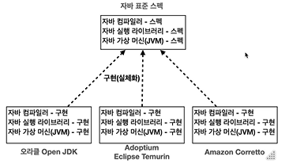
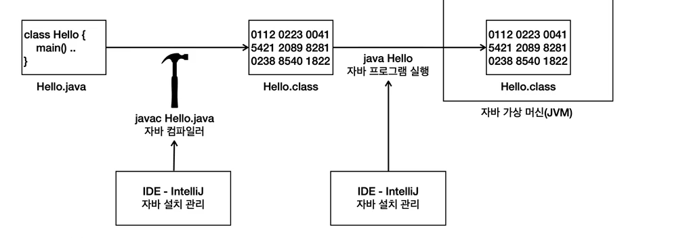

# 자바란? 

## 자바의 표준스펙과 구현

### 자바 표준 스펙
- 자바는 표준 스펙과 구현으로 나눌 수 있다.
- 이 표준 스펙을 기반으로 여러 회사에서 실제 작동하는 자바를 만든다
- 자바의 표준 스펙은 자바 커뮤니티 프로세서(**JCP**)를 통해 관리된다.

### 다양한 구현 
- 여러 회사에서 자바표준 스펙에 맞추어 실제 작동하는 자바 프로그램을 개발
- 각각 최적화가 다르다, ex> 아마존 코렉토는 AWS환경에 최적화 되어있다.
- 각 회사는 다양한 OS에서 작동하는 버전의 자바도 함께 제공한다.
  
    ※ 다양한 자바 구현에 대한 참고 사이트 : https://whichjdk.com/ko

### 변경의 용이
- 자바 구현들은 모두 표준 스펙에 맞도록 개발
- 따라서 오라클 jdk를 사용하다 아마존 코레토 자바로 변경해도 대부분 문제없이 작동

### 컴파일과 실행
- 자바 프로그램은 컴파일과 실행 단계를 거침
- 자바 소스코드를 개발자가 작성
- 자바 컴파일로 소스 코드를 컴파일
  - javac라는 컴파일러 사용
  - .java -> .class 파일로 변환
  - 자바 소스코드를 바이트 코드로 변환, 자바 가상머신에서 더 빠르게 실행되도록 최적화, 문법오류 검출
- 자바 프로그램 실행
  - 자바가 제공하는 java 프로그램 사용
  - 자바 가상머신 (JVM)이 실행되며 프로그램이 작동

### IDE와 자바
**인텔리 제이를 통한 자바 설치 관리**
- 인텔리제이는 내부에 자바를 편리하게 설치하고 관리할 수 있는 기능 제공
- 이 기능을 사용하여 자바를 다운로드, 실행 가능

**인텔리제이를 통한 자바 컴파일, 실행 과정**

- 컴파일
  - 자바 코드를 컴파일 하려면 javac라는 프로그램을 직접 사용해야함
  - 인텔리제이는 자바코드를 실행 시 이부분을 자동으로 처리
  - 인텔리제이 화면에 프로젝트가 있는 out 폴더에서 확인 가능
  - 이 단계에서 필요없는 주석을 지우고 최적화를 한다.

- 실행
  - 자바를 실행하려면 java 프로그램 사용, 컴파일된 .class 파일로 지정
  - 확장자는 제외
  - 인텔리제이에서 자바코드를 실행하면 컴파일과 실행을 모두 한번에 처리

### 자바와 운영체제 독립성

**일반적인 프로그램**
- 일반적인 프로그램의 경우 다른 운영체제에서 실행 할 수 없다.

**자바 프로그램**
- 자바 프로그램은 자바가 설치된 모든 os 에서 실행할 수 있다.
- os 에 대한 호환성 문제는 자바가 해결한다.
- 각 os에 맞도록 자바를 설치하기만 하면 된다.

**자바 개발과 운영 환경**
- 개발 편의를 위해  윈도우나 맥 os 를 주로 사용
- 서버는 주로 리눅스를 사용
- AWS를 사용한다면 아마존 코렉토 자바를 aws 리눅스 서버에 설치하면 된다.
- 운영 체재에 대한 독립성 덕분에 각각 환경에 맞추어 자바를 설치하는 것이 가능하다.

# 자바
패키지 : 자바 파일을 모아놓은 폴더
- 반드시 패키지 명이 최 상단에 선언되어야함
- 인텔리제이의 경우 자동으로 선언되게 되어있다.

## 변수 
- 자바의 경우 변수 선수 : 자료형과 변수명 선언
- 변수 초기화 (대입) : 등기호를 사용하여 값을 선언
- 변수 값 변경
  - 변수 명에 등기호를 사용하여 새로운 값 대입
- 변수 선언과 초기화
  - 변수는 한번에 여러개를 선언 할 수 있다.
  - 변수를 선언하면 컴퓨터 메모리공간을 확보하여 데이터를 저장
  - 변수의 이름을 통하여 해당 메모리에 접근 
  - 선언과 동시에 초기화도 가능하다 자료형 변수명 = 값의 형태
  - 변수 초기화 없이 사용하는 경우 
    - java: variable a might not have been initialized 라는 오류 발생
  - 초기화 하지 않은 변수는 메모상의 공간이고, 이 공간에 값은 아무도 모른다.
  - 따라서 자바는 변수를 초기화 하도록 강제한다.

- 지역 변수 : 지역 변수는 개발자가 직접 초기화 해주어야한다.
- 클래스 변수, 인스턴스 변수 : 자바가 자동으로 초기화 진행

- 변수의 타입
  - int 정수
  - double 실수 
  - boolean 참 거짓 
  - char 한 글자 (작은 따옴표)
  - String 문자열 (대문자, 쌍따옴표)
  - 타입이 맞지 않는 경우 오류
  - 리터럴 : 코드에 개발자가 직접 적은 변수에 대입한 고정된 값

- 숫자 변수
  - 정수
    - byte = -128 ~ 127
    - short = -32,769 ~ 32,767
    - int = -2,147,482,648 ~ 2,147,482,647
    - long = -9,223,372,036,854,775,807 ~ -9,223,372,036,854,775,807
      - long 의 경우 숫자 뒤에 L 대분자 엘을 붙인다.
  - 실수
    - float : 숫자f 의 형태
    - double : float 보다 큰 숫자를 사용 할 수 있다.
- 기타
  - booloean
  - char
  - String : 메모리 사용량은 문자길이에 따라 동적으로 달라짐

- 리터럴 타입 지정
  - 정수 리터럴은 주로 int 사용, 20억이 넘어가면 long으로 변환하고 뒤에 L을 붙인다 소문자는 헷갈리기 때문에 대문자 권장
  - 실수 리터럴은 기본 double 사용, float 사용의 경우 숫자뒤에 f를 붙여야한다.
  - 글자 하나도 String을 사용할 수 있기 때문에 주로 String을 사용 한다.

- 변수 명명 규칙
  - 변수 이름은 숫자로 시작할 수 없다, 숫자를 포함하는 것은 가능하다
  - 이름에는 공백이 들어갈 수 없다
  - 자바의 예약어를 변수이름으로 사용할 수 없다.
  - 변수이름에는 영문자, 숫자, 달러 기호, 언더바만 사용할 수 있다.
  - 관례
    - 낙타 표기법, 소문자 시작 각 단어는 대문자로 표기

- 클래스 명명 규칙
  - 첫 글자는 대문자, 이어지는 단어는 낙타표기법 사용

- 상수 표기법
  - 모두 대문자 사용, 언더바로 구분

- 패키지 표기법
  - 패키지는 모두 소문자 사용

## 연산자

- 산술 연산자
  - [+, -, *, /, %(나머지)]
  - %를 사용할 때 분모가 0이 되는 경우
    - Exception in thread "main" java.lang.ArithmeticException: / by zero 오류 발생
    - 예외가 발생하면 프로그램 종료.
- 증감 연산자
  - [++, --] 
  - 변수의 값을 1만큼 증가 혹은 감소'
  - 전위, 후위 증감 연산자
    - 증감 연산자는 피연산자의 앞 혹은 뒤에 오느냐에 따라 수행 시점이 달라진다.
      - ++a : 전위 증감 연산자, 값 증가 먼저 값 사용
      - a++ : 후위 증감 연산자, 값을 먼저 사용한 후 값 증가
- 시프트 연산자
  - [>>, <<, >>>]
- 비교 연산자
  - [>, <. >=, <=, ==, !=]
  - 조건문에서 주로 사용됨
  - 참 혹은 거짓의 boolean 형 결과가 나온다
  - = 과 ==는 다르다
  - !는 반대라는 뜻이다.
  - 문자열이 같은지 비교 하려면 .equals() 매서드를 사용해야한다.
- 비트 연산자 
  - [&, |, ^, ~, >>, <<,>>>]
  - 실무에서 사용이 많지는 않음
- 논리 연산자
  - [&&(and), ||(or), !(nor)]
- 대입 연산자
  - [ =, *=, /=, %=, +=, -=]
  - 값을 점수에 할당하는 연산자
  - 축약, 복합대입 연산자 : 산술+대입연산자
    - 연산 후 바로 대입
- 조건(삼항) 연산자
  - [?, :]
- instanceof 연산자
  - 객체 타입 확인
- 그 외
  - new
  - [] 배열 인텍스
  - . 객체 멤버 접근
  - () 메서드 호출
- 
- 연산자의 우선 순위
  - 산술 연산자의 경우 숫자 계산과 동일, 우선 적인 것은 괄호로 묶어준다.
  - 괄호
  - 단항 연산자
  - 산술 연산자
  - shift 연산자
  - 비교 연산자
  - 등식 연산자
  - 비트 연산자
  - 논리 연산자
  - 삼항 연산자 
  - 대입 연산자

### 조건문

- 특정 조건에 따라 다른 코드를 실행하고자 할 떄
- if 문과 switch 문이 있다.
- if
  - if, if-else, else if 문이 있다
  - if - else if 문은 서로 연관된 조건이라 하나로 묶을 떄
  - if - if 문은 독립 조건일 때 사용한다.

### 반복문

- 특정조건을 만족할떄까지 반복하고 조건이 거짓이면 종료됨
- while, do-while, for문이 있다.
- break와 continue
  - break는 반복문을 즉시 종료하고 나감
  - continue는 반복문의 나머지 부분을 건너뛰고 다음 반복을진행
  - 둘다 모든 반복문에서 사용할 수 있다.

### 문자열

- 문자열은 항상””로 감싼다.
  - 변수명.length - 길이 확인
  - toUpperCase  - 전부 대문자고
  - toLower Case - 전부 소문자로
  - contains - 포함 여부 boolean
  - indexOf - 인덱스 확인
  - lastIndexOf - 마지막 위치 정보 (중복 중 마지막)
  - startsWith - 문자열로 시작 여부 boolean
  - endsWith - 문자열로 마침여부 boolean
  - replace - 문자열 변환
  - substring - 문자열 자르기 인덱스 기준 - 끝 (시작 인덱스 미포함)
  - trim - 앞 뒤 공백 제거
  - concat - 문자열 결합

- 특수문자
  - \n - 줄바꿈
  - \t - 탭
  - \\ - 역슬래시
  - \” - 큰따옴표
  - \’ - 작은 따옴표

### 배열

- 배열의 선언
  - 자료형[] 변수명 - new 자료형[크기]
  - 자료형 변수명[] - new 자료형[크기]
    - int[] numbers = new int[5]
    - int numbers[]  = new int[5]

- 배열 선언과 동시에 값 넣기
  - 자료형[] 변수명 = **new 자료형[]** {값1 ,2,3,4,5,}
  - **new 자료형[] 이 부분은 생략이 가능**

- 특정 위치에 값 넣기
  - 변수명[인덱스] = 값
- 배열 순회
  - 반복문을 이용해서 배열에 각 값에 접근
  - for  문을 사용함 
    - for int i : 변수명.length
    - for int i : 변수명

- 다차원 배열
  - 자료형[][] 변수명 = new 자료형 [세로][가로]
  - 자료형[] 변수명 = **new 자료형[]** {
    {첫번째 세로줄 데이터}
    {두번쨰 세로줄 데이터} 
    }

- 다차원 배열 순회
  - for(int i = 0 : i< 세로: i++){
      for(int j = 0 : j< 가로; j++) 
    } 
  이런식으로 두번 접근해야한다.

  - for(int i = 0 : i< 변수명.length: i++){
       for(int j = 0 : j< 변수명[i].length; j++)
    } 
  두개의 결과 값은 동일하다.

### 메소드

- 특정기능을 하기 위한 코드의 묶음
  - 접근 제어자 반환형 메소드명 (전달값 ){
    명령문 1
    명령문 2
    }

### 전달값

- 메소드 호출 시 전달하는 값
  - 접근제어자 반환형 메소드명 (**전달값**){
    명령문 1
    명령문 2
    }
- 여러 값을 한번에 선언, 전달가능

### 반환값

- 메소드 실행 결과를 반환하는 값
  - 접근제어자 **반환형** 메소드명 (전달값){
      명령문 1
      명령문 2
      **return 반환값**
    }

### 메소드 오버로딩

- 같은 이름을 가지면서 자료형, 이름등이 다른 매개변수를 받는 것

### 변수의 범위

- 변수를 사용할 수있는 유효한 영역
  - 변수가 선언 된 영역 {}내부에서만 사용가능

### 클래스

- 데이터와 기능을 포함하는 코드 묶음
- class 클래스명 {}

### 인스턴스 변수
- 클래스 내 선언된 변수
- class 클래스명 {인스턴스 변수1,2,3,}
- 객체 마다 다른 값을 가질 수 있다

### 클래스 변수
- 클래스 내에서 static이 붙은 변수
- 모든 객체가 공유하는 변수
- 객체를 만들 필요 없이 클래스 명으로 접근

### 인스턴스 메소드
- 클래스 내에 선언된 메소드
- 사용 시 객체를 생성하여 사용

### 클래스 메소드
- 클래스 내 static이 붙은 메소드
- 객체를 생성할 필요 없이 클래스 명으로 접근

### this

- 자기 자신, 인스턴스/ 지역 변수의 구분을 위하여 사용
- this.인스턴스 변수;

### 생성자 
- 객체가 생성될 때 호출되는 메소드
- 클래스명(전달 값){
  초기화 명령문
  }

### Getter 와 Setter